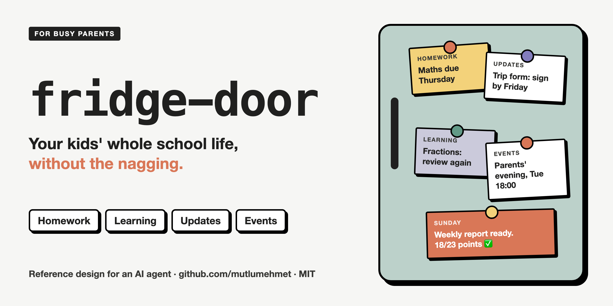
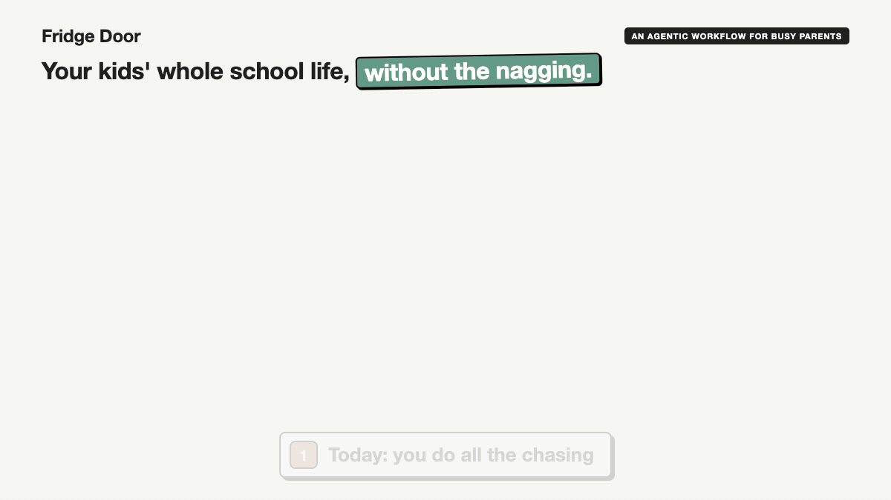
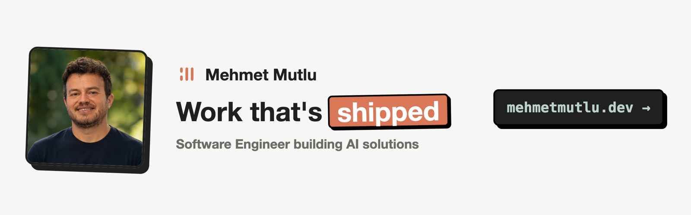

# Fridge Door

An agentic workflow for busy parents struggling to keep up with their kids' school life: homework, learning, updates and events.

> This repository is a reference design: it describes a system you build for your own family with an AI agent, and ships the templates to start from. It is not a hosted service.

## The problem

Life is full, for parents and kids alike. School sends a steady stream of emails, newsletters, portal notifications, forms, trip letters and payment requests. Homework lives on several different platforms. Each subject moves on to a new topic every few weeks, and nobody knows whether the last one really landed.

The usual fix is a tracking sheet. It works for as long as a parent keeps reminding the kids to fill it in. The day the reminders stop, the sheet stops too, and the parent has become the family's nag.

Fridge Door moves that job to a system. The kids get short, friendly reminders from the system, not from you. A short weekly quiz checks what "I did it" really means. The parents read one report on Sunday and set the goal for the week ahead.

## What it keeps track of

| Area | Examples |
|---|---|
| Homework | What is due, what is done, what was handed in late |
| Learning | Topics covered each day, how well the child says they understood them, Sunday quiz results, topics due for review |
| Updates | School emails, newsletters, portal notices, forms to sign, payments to make |
| Events | Trips, clubs, exams, parents' evenings and deadlines, in one weekly view |
| Habits | The daily study block, reading minutes and pages |

## How it works

1. **Reminders are automatic.** A message at homework time and one at check-in time, sent through the messaging app your family already uses.
2. **The check-in is short.** Three to five minutes a day from a phone: topics covered, homework done, reading.
3. **Claims are checked.** A short paper quiz on Sunday covers that week's topics. School data (portal scores, reports) has the final word.
4. **Effort is rewarded, not punished.** A simple weekly points score. Below the target there is no punishment: free time starts once the gaps are filled.
5. **Parents read one weekly report.** Points, homework, topics, quiz results, school updates and next week's events, on one page.

## What is in this repository

| Path | What |
|---|---|
| [`docs/design.md`](docs/design.md) | The full design: every part, the architecture, where things run |
| [`docs/privacy.md`](docs/privacy.md) | How to keep your children's data with your family |
| [`templates/notion/databases.md`](templates/notion/databases.md) | The six databases and their fields |
| [`templates/messages.md`](templates/messages.md) | Starting texts for every reminder |
| [`config.example.yaml`](config.example.yaml) | Children, targets, points, reminder times, sources |
| [`skills/weekly-report/`](skills/weekly-report/SKILL.md) | A Claude skill that writes the weekly report and the Sunday quiz, and marks the quiz |
| [`scripts/md2pdf.py`](scripts/md2pdf.py) | Turns a report or a quiz into a printable A4 PDF (needs `pip install markdown` and Chrome) |
| [`examples/`](examples/README.md) | One week for a made-up family: the report, two quiz sheets, two answer keys, as Markdown and PDF |

## What it will never do

- Keep your children's data anywhere you did not choose.
- Ship scrapers for specific school platforms, or ways around their bot protection.
- Recommend unofficial messaging bridges that break a platform's terms.
- Send your children a message the parents have not approved first.

## Status

The design, templates, the weekly report skill and a full example week are here. Built and tested as a reference: adapt it to your own family, school and tools.

## About

Built by Mehmet Mutlu, a software engineer and a parent. More of his work: [mehmetmutlu.dev](https://www.mehmetmutlu.dev).

If this saves your family a few arguments, you can [sponsor me on GitHub](https://github.com/sponsors/mutlumehmet) or [buy me a coffee](https://buymeacoffee.com/mutlumehmet).

## License

[MIT](LICENSE)
